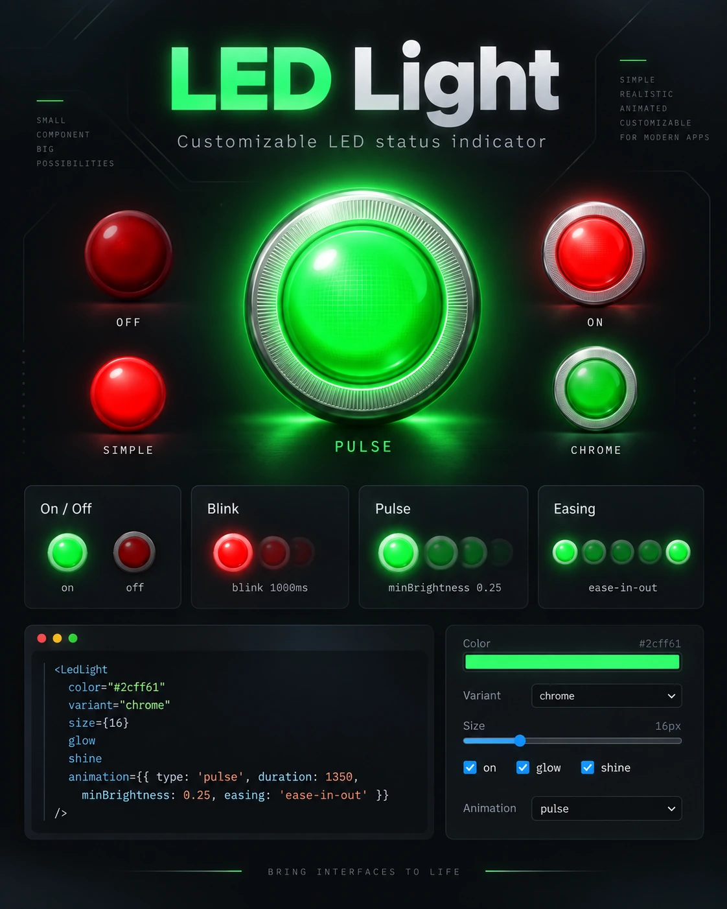

# LED Light Component



This LED Light component provides a simple, customizable LED light indicator for React applications. It allows developers to easily integrate a visual indicator light into their projects, with customizable colors, variants (simple/realistic/chrome), size, on/off state, and blink/pulse animation.

## Installation

Install the LED Light component using npm:

```bash
npm install react-led-light
```

Or using yarn:

```bash
yarn add react-led-light
```


## Usage

To use the component, import it and its stylesheet into your React project:

```tsx
import LedLight from 'react-led-light';
import 'react-led-light/dist/LedLight.css';
```

The stylesheet is a separate file (rather than auto-injected) so the component works safely in server-rendered environments (Next.js, Remix, etc.) without touching `document` at import time.

Then, you can add it to your component:

```tsx
<div>
  <h1>LED Indicator</h1>
  <LedLight color="green" />
  <LedLight color="orange" glow />
  <LedLight color="red" variant="realistic" size={24} shine />
  <LedLight color="silver" variant="chrome" size={24} shine />
  <LedLight
    color="#2cff61"
    variant="realistic"
    size={24}
    on
    animation={{ type: 'pulse', duration: 1200, minBrightness: 0.25, easing: 'ease-in-out' }}
  />
</div>
```

## Props

| Prop        | Type                    | Default    | Description                                                                 |
|-------------|-------------------------|------------|------------------------------------------------------------------------------|
| `color`     | `string`                | `"orange"` | Any valid CSS color (keyword, hex, `rgb()`, `rgba()`, etc).                  |
| `variant`   | `'simple' \| 'realistic' \| 'chrome'` | `"simple"` | `simple` is a flat status dot; `realistic` adds a metallic socket and bevel; `chrome` adds a brushed-metal, conical bezel. |
| `size`      | `number`                | `16`       | Diameter in pixels. All other dimensions scale proportionally.               |
| `on`        | `boolean`               | `true`     | When `false`, the LED stays visible but dims, drops its glow, and ignores `animation`. |
| `glow`      | `boolean`               | `false`    | Adds a soft halo around the LED.                                            |
| `shine`     | `boolean`               | `false`    | Adds a specular highlight on the light disc itself (a small pre-rendered PNG overlay, blended with `mix-blend-mode: screen`) for a convex, 3D look. |
| `animation` | `LedAnimationConfig`    | `undefined`| Optional blink/pulse animation (see below). Ignored while `on` is `false`.   |
| `className` | `string`                | `undefined`| Extra class name(s) applied to the root element.                            |
| `style`     | `React.CSSProperties`   | `undefined`| Inline styles merged onto the root element.                                 |
| `role`, `aria-*` | —                  | —          | Passed through to the root element; see Accessibility below.                |

### `animation`

```ts
interface LedAnimationConfig {
  type: 'blink' | 'pulse';
  duration?: number;       // ms — default 1000 (blink) / 1200 (pulse)
  minBrightness?: number;  // 0–1 — default 0 (blink) / 0.25 (pulse)
  easing?: 'linear' | 'ease' | 'ease-in' | 'ease-out' | 'ease-in-out' | 'step';
  // default 'step' (blink) / 'ease-in-out' (pulse)
}
```

`blink` toggles between fully lit and `minBrightness` on each half of the cycle. `pulse` fades smoothly between the two. Setting `easing: 'step'` always produces an instant on/off cut regardless of `type`; any other easing produces a smooth fade.

Animation respects the OS/browser `prefers-reduced-motion` setting: when reduced motion is requested, the LED stops animating and displays fully lit instead, so its status is still communicated without motion.

## Customization

Each LED renders a root `Led-root` element (carrying `Led-root--simple`/`Led-root--realistic`/`Led-root--chrome`, and `Led-root--off`/`Led-root--bare` when applicable), an optional `.Socket` (realistic/chrome variants), and a `.LightDisc` wrapper (carrying `Glow`/`LightDisc--animated` when applicable) containing the `.Led` circle and an optional `.Shine` overlay. Glow and animation live on `.LightDisc` rather than the root specifically so a blink/pulse animates the light itself without ever dimming the encasing ring.

The supported public CSS custom properties are:

| Custom property        | Default            | Description                                  |
|-------------------------|--------------------|-----------------------------------------------|
| `--led-size`            | `16px`             | Same as the `size` prop; settable from CSS.   |
| `--led-color`           | the `color` prop   | LED color, also settable from CSS.            |
| `--led-glow-strength`   | `1`                | Multiplier on the realistic/chrome variants' glow falloff. |
| `--led-ring-color`      | `#9a9a9a` (realistic) / `#b9b9b9` (chrome) | Socket/bezel base color. |

Avoid targeting other internal selectors directly — they're implementation details and may change between releases.

## Accessibility

`LedLight` renders an indicator, not an interactive control, so it never receives keyboard focus. By default it renders with `aria-hidden="true"`, since a color-only status shouldn't be assumed meaningful to assistive tech without context. If the LED conveys real information, pass an `aria-label` (or `role`) and it will be exposed instead of hidden:

```tsx
<LedLight color="green" aria-label="Connected" />
```

For richer status displays, consider pairing the LED with visible text (e.g. `● Connected`) rather than relying on color alone.

## Contributing

Contributions to enhance the LED Light component, add more features, and maintain the package are welcome. Please ensure to follow the existing code style, add unit tests for new features, and document any changes.

## License

This project is licensed under the MIT License - see the [LICENSE](LICENSE) file for details.